# ML Lab — Flowcharts

All diagrams are Mermaid (source in `diagrams/src/*.mmd`) and rendered to PNG in `diagrams/` with mermaid-cli. Section numbers are referenced from ARCHITECTURE.md (e.g. §3 → `diagrams/03_system_architecture.png`).

## Contents

1. [Overall user journey](#1-overall-user-journey)
2. [Supervised pipeline (regression and classification)](#2-supervised-pipeline-(regression-and-classification))
3. [System architecture](#3-system-architecture)
4. [Unsupervised pipeline](#4-unsupervised-pipeline)
5. [Time-series pipeline](#5-time-series-pipeline)
6. [Financial sequential validation (mirrors ml-for-trading / TradingLab)](#6-financial-sequential-validation-(mirrors-ml-for-trading-/-tradinglab))
7. [AI Insights sequence](#7-ai-insights-sequence)
8. [Prediction / inference](#8-prediction-/-inference)
9. [Walk-Forward Optimisation (financial / sequential)](#9-walk-forward-optimisation-(financial-/-sequential))
10. [AI Dataset Intake / Auto-Setup](#10-ai-dataset-intake-/-auto-setup)
11. [Deep learning (tabular and sequential)](#11-deep-learning-(tabular-and-sequential))
12. [Time series — full pipeline](#12-time-series--full-pipeline)
13. [Dimensionality reduction](#13-dimensionality-reduction)
14. [Clustering](#14-clustering)
15. [Financial labelling suitability check](#15-financial-labelling-suitability-check)
16. [VLM decision agent loop](#16-vlm-decision-agent-loop)
17. [Deployment and CI/CD](#17-deployment-and-cicd)
18. [AI provider layer (hosted VLM/LLM)](#18-ai-provider-layer-hosted-vlmllm)
19. [Classification evaluation suite](#19-classification-evaluation-suite-architecture-41)
20. [Prediction Studio — batch upload and custom input](#20-prediction-studio--batch-upload-and-custom-input-architecture-45)

## 1. Overall user journey

End-to-end flow from login to registry, prediction, reports and export, with AI Insights at each stage.

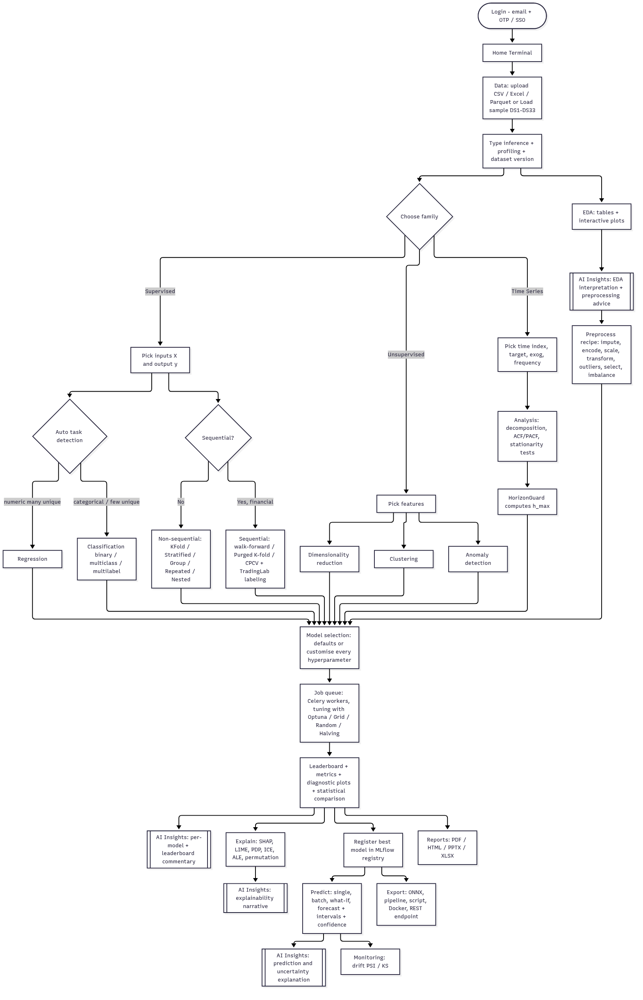

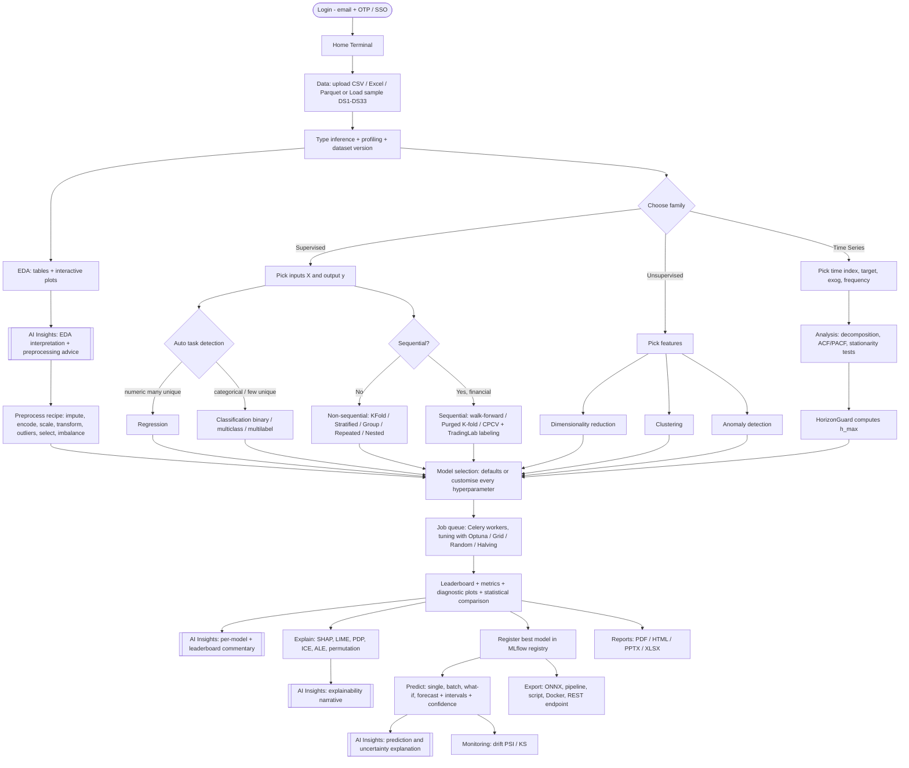
```mermaid
flowchart TD
  A([Login - email + OTP / SSO]) --> B[Home Terminal]
  B --> C[Data: upload CSV / Excel / Parquet or Load sample DS1-DS33]
  C --> D[Type inference + profiling + dataset version]
  D --> E{Choose family}
  E -->|Supervised| F[Pick inputs X and output y]
  F --> G{Auto task detection}
  G -->|numeric many unique| G1[Regression]
  G -->|categorical / few unique| G2[Classification binary / multiclass / multilabel]
  F --> H{Sequential?}
  H -->|No| H1[Non-sequential: KFold / Stratified / Group / Repeated / Nested]
  H -->|Yes, financial| H2[Sequential: walk-forward / Purged K-fold / CPCV + TradingLab labeling]
  E -->|Unsupervised| U[Pick features]
  U --> U1[Dimensionality reduction]
  U --> U2[Clustering]
  U --> U3[Anomaly detection]
  E -->|Time Series| T[Pick time index, target, exog, frequency]
  T --> T1[Analysis: decomposition, ACF/PACF, stationarity tests]
  T1 --> T2[HorizonGuard computes h_max]
  D --> X[EDA: tables + interactive plots]
  X --> AI1[[AI Insights: EDA interpretation + preprocessing advice]]
  AI1 --> P[Preprocess recipe: impute, encode, scale, transform, outliers, select, imbalance]
  P --> M[Model selection: defaults or customise every hyperparameter]
  G1 --> M
  G2 --> M
  H1 --> M
  H2 --> M
  U1 --> M
  U2 --> M
  U3 --> M
  T2 --> M
  M --> Q[Job queue: Celery workers, tuning with Optuna / Grid / Random / Halving]
  Q --> L[Leaderboard + metrics + diagnostic plots + statistical comparison]
  L --> AI2[[AI Insights: per-model + leaderboard commentary]]
  L --> XP[Explain: SHAP, LIME, PDP, ICE, ALE, permutation]
  XP --> AI3[[AI Insights: explainability narrative]]
  L --> R[Register best model in MLflow registry]
  R --> PR[Predict: single, batch, what-if, forecast + intervals + confidence]
  PR --> AI4[[AI Insights: prediction and uncertainty explanation]]
  PR --> MON[Monitoring: drift PSI / KS]
  L --> RP[Reports: PDF / HTML / PPTX / XLSX]
  R --> EX[Export: ONNX, pipeline, script, Docker, REST endpoint]
```

## 2. Supervised pipeline (regression and classification)

Leakage-safe recipe fitted inside each fold; registry-driven algorithms; tuning presets; leaderboard; explainability; uncertainty.

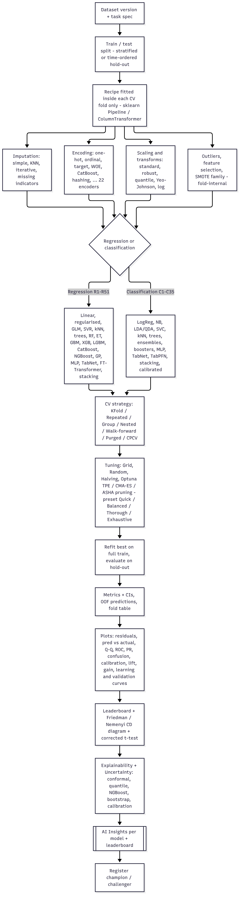

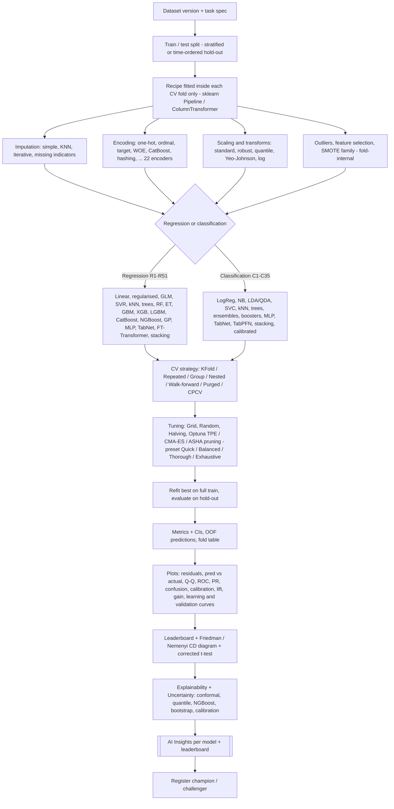
```mermaid
flowchart TD
  A[Dataset version + task spec] --> B[Train / test split - stratified or time-ordered hold-out]
  B --> C[Recipe fitted inside each CV fold only - sklearn Pipeline / ColumnTransformer]
  C --> C1[Imputation: simple, KNN, iterative, missing indicators]
  C --> C2[Encoding: one-hot, ordinal, target, WOE, CatBoost, hashing, ... 22 encoders]
  C --> C3[Scaling and transforms: standard, robust, quantile, Yeo-Johnson, log]
  C --> C4[Outliers, feature selection, SMOTE family - fold-internal]
  C1 --> D
  C2 --> D
  C3 --> D
  C4 --> D
  D{Regression or classification}
  D -->|Regression R1-R51| E1[Linear, regularised, GLM, SVR, kNN, trees, RF, ET, GBM, XGB, LGBM, CatBoost, NGBoost, GP, MLP, TabNet, FT-Transformer, stacking]
  D -->|Classification C1-C35| E2[LogReg, NB, LDA/QDA, SVC, kNN, trees, ensembles, boosters, MLP, TabNet, TabPFN, stacking, calibrated]
  E1 --> F[CV strategy: KFold / Repeated / Group / Nested / Walk-forward / Purged / CPCV]
  E2 --> F
  F --> G[Tuning: Grid, Random, Halving, Optuna TPE / CMA-ES / ASHA pruning - preset Quick / Balanced / Thorough / Exhaustive]
  G --> H[Refit best on full train, evaluate on hold-out]
  H --> I[Metrics + CIs, OOF predictions, fold table]
  I --> J[Plots: residuals, pred vs actual, Q-Q, ROC, PR, confusion, calibration, lift, gain, learning and validation curves]
  J --> K[Leaderboard + Friedman / Nemenyi CD diagram + corrected t-test]
  K --> L[Explainability + Uncertainty: conformal, quantile, NGBoost, bootstrap, calibration]
  L --> M[[AI Insights per model + leaderboard]]
  M --> N[Register champion / challenger]
```

## 3. System architecture

Hosted primary path (ARCHITECTURE §39): browser → Vercel (Next.js BFF, no heavy compute) → Render `lab-api` (FastAPI) → Render Key Value (Celery broker) → Render background workers (light + train) running labcore with vendored TradingLab → Supabase (Postgres + RLS, Auth, Storage). AI insights and decisions call the hosted NVIDIA API catalog from Render only (`NVIDIA_API_KEY` never in Vercel), with optional Gemini/OpenRouter/Groq fallbacks and numbers-only offline mode (ARCHITECTURE §40); an external GPU worker is optional for heavy DL only. GitHub Actions deploys all three.

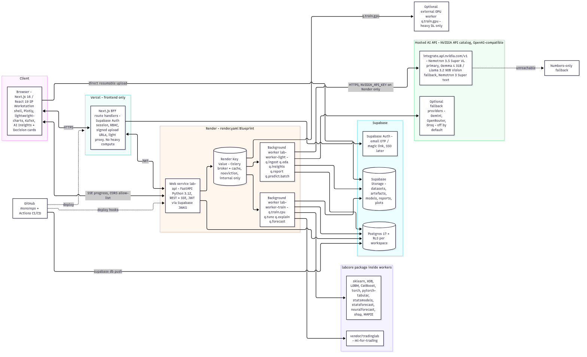

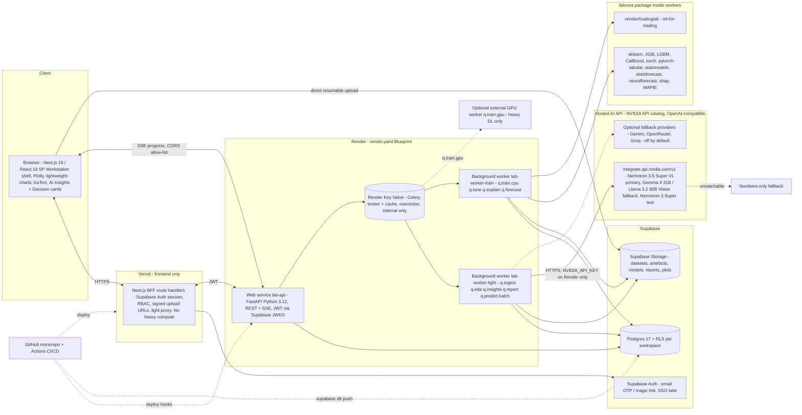
```mermaid
flowchart LR
  subgraph Client
    W[Browser - Next.js 16 / React 19 SP Workstation shell, Plotly, lightweight-charts, KaTeX, AI Insights + Decision cards]
  end
  subgraph Vercel[Vercel - frontend only]
    G[Next.js BFF route handlers - Supabase Auth session, RBAC, signed upload URLs, light proxy. No heavy compute]
  end
  subgraph Render[Render - render.yaml Blueprint]
    F[Web service lab-api - FastAPI Python 3.12, REST + SSE, JWT via Supabase JWKS]
    KV[(Render Key Value - Celery broker + cache, noeviction, internal only)]
    WL[Background worker lab-worker-light - q.ingest q.eda q.insights q.report q.predict.batch]
    WT[Background worker lab-worker-train - q.train.cpu q.tune q.explain q.forecast]
  end
  subgraph Supabase
    PG[(Postgres 17 + RLS per workspace)]
    AU[Supabase Auth - email OTP / magic link, SSO later]
    ST[(Supabase Storage - datasets, artefacts, models, reports, plots)]
  end
  subgraph AI[Hosted AI API - NVIDIA API catalog, OpenAI-compatible]
    OL[integrate.api.nvidia.com/v1 - Nemotron 3.5 Super VL primary, Gemma 4 31B / Llama 3.2 90B Vision fallback, Nemotron 3 Super text]
    FP[Optional fallback providers - Gemini, OpenRouter, Groq - off by default]
  end
  GW[Optional external GPU worker q.train.gpu - heavy DL only]
  subgraph Engine[labcore package inside workers]
    LC[sklearn, XGB, LGBM, CatBoost, torch, pytorch-tabular, statsmodels, statsforecast, neuralforecast, shap, MAPIE]
    TL[vendor/tradinglab - ml-for-trading]
  end
  GH[GitHub monorepo + Actions CI/CD] -.deploy.-> Vercel
  GH -.->|deploy hooks| F
  GH -.->|supabase db push| PG
  W <-->|HTTPS| G
  W <-->|SSE progress, CORS allow-list| F
  W -->|direct resumable upload| ST
  G --> AU
  G <-->|JWT| F
  F --> PG
  F --> KV
  KV --> WL
  KV --> WT
  KV -.->|q.train.gpu| GW
  WL --> PG
  WT --> PG
  WL --> ST
  WT --> ST
  WT --> LC
  WT --> TL
  WL -->|HTTPS, NVIDIA_API_KEY on Render only| OL
  WL -.-> FP
  OL -.->|unreachable| NF[Numbers-only fallback]
```

## 4. Unsupervised pipeline

Dimensionality reduction, clustering and anomaly detection with selection indices and profiles.

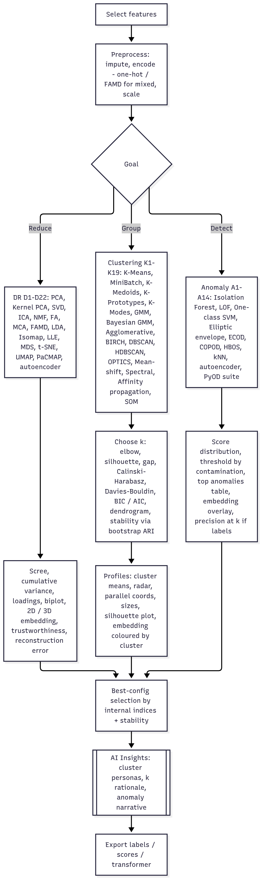

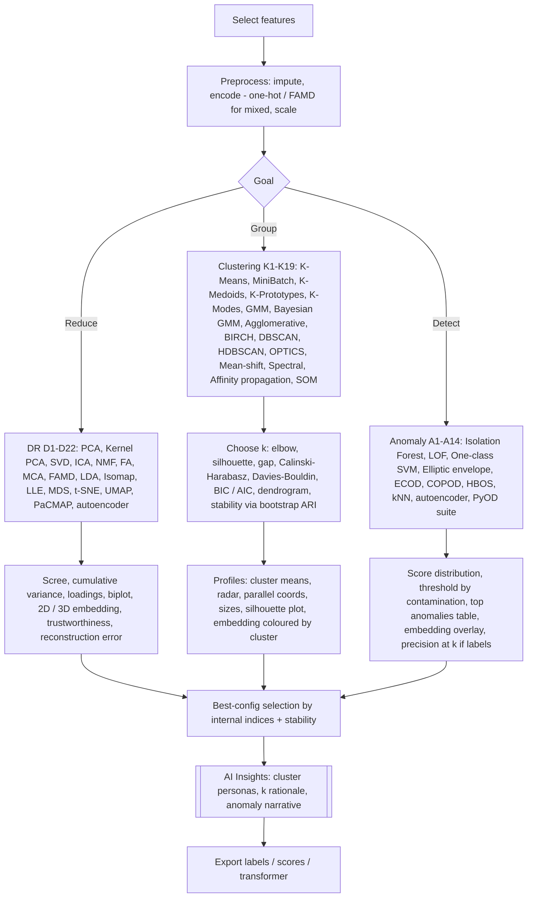
```mermaid
flowchart TD
  A[Select features] --> B[Preprocess: impute, encode - one-hot / FAMD for mixed, scale]
  B --> C{Goal}
  C -->|Reduce| D[DR D1-D22: PCA, Kernel PCA, SVD, ICA, NMF, FA, MCA, FAMD, LDA, Isomap, LLE, MDS, t-SNE, UMAP, PaCMAP, autoencoder]
  D --> D1[Scree, cumulative variance, loadings, biplot, 2D / 3D embedding, trustworthiness, reconstruction error]
  C -->|Group| E[Clustering K1-K19: K-Means, MiniBatch, K-Medoids, K-Prototypes, K-Modes, GMM, Bayesian GMM, Agglomerative, BIRCH, DBSCAN, HDBSCAN, OPTICS, Mean-shift, Spectral, Affinity propagation, SOM]
  E --> E1[Choose k: elbow, silhouette, gap, Calinski-Harabasz, Davies-Bouldin, BIC / AIC, dendrogram, stability via bootstrap ARI]
  E1 --> E2[Profiles: cluster means, radar, parallel coords, sizes, silhouette plot, embedding coloured by cluster]
  C -->|Detect| F[Anomaly A1-A14: Isolation Forest, LOF, One-class SVM, Elliptic envelope, ECOD, COPOD, HBOS, kNN, autoencoder, PyOD suite]
  F --> F1[Score distribution, threshold by contamination, top anomalies table, embedding overlay, precision at k if labels]
  D1 --> G[Best-config selection by internal indices + stability]
  E2 --> G
  F1 --> G
  G --> H[[AI Insights: cluster personas, k rationale, anomaly narrative]]
  H --> I[Export labels / scores / transformer]
```

## 5. Time-series pipeline

Analysis → tests → HorizonGuard → statistical / ML / DL forecasters → rolling-origin backtest → intervals → leaderboard.

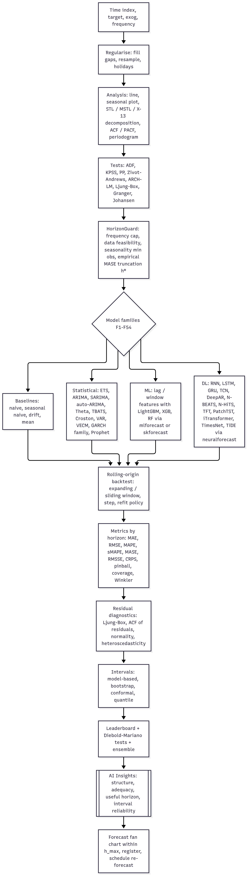

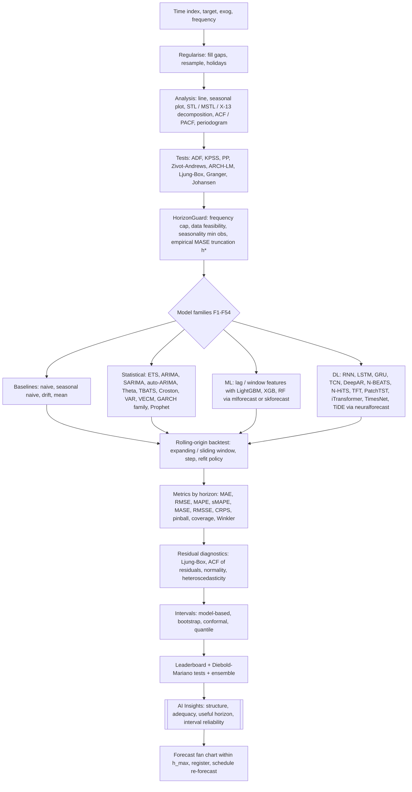
```mermaid
flowchart TD
  A[Time index, target, exog, frequency] --> B[Regularise: fill gaps, resample, holidays]
  B --> C[Analysis: line, seasonal plot, STL / MSTL / X-13 decomposition, ACF / PACF, periodogram]
  C --> D[Tests: ADF, KPSS, PP, Zivot-Andrews, ARCH-LM, Ljung-Box, Granger, Johansen]
  D --> E[HorizonGuard: frequency cap, data feasibility, seasonality min obs, empirical MASE truncation h*]
  E --> F{Model families F1-F54}
  F --> F1[Baselines: naive, seasonal naive, drift, mean]
  F --> F2[Statistical: ETS, ARIMA, SARIMA, auto-ARIMA, Theta, TBATS, Croston, VAR, VECM, GARCH family, Prophet]
  F --> F3[ML: lag / window features with LightGBM, XGB, RF via mlforecast or skforecast]
  F --> F4[DL: RNN, LSTM, GRU, TCN, DeepAR, N-BEATS, N-HiTS, TFT, PatchTST, iTransformer, TimesNet, TiDE via neuralforecast]
  F1 --> G[Rolling-origin backtest: expanding / sliding window, step, refit policy]
  F2 --> G
  F3 --> G
  F4 --> G
  G --> H[Metrics by horizon: MAE, RMSE, MAPE, sMAPE, MASE, RMSSE, CRPS, pinball, coverage, Winkler]
  H --> I[Residual diagnostics: Ljung-Box, ACF of residuals, normality, heteroscedasticity]
  I --> J[Intervals: model-based, bootstrap, conformal, quantile]
  J --> K[Leaderboard + Diebold-Mariano tests + ensemble]
  K --> L[[AI Insights: structure, adequacy, useful horizon, interval reliability]]
  L --> M[Forecast fan chart within h_max, register, schedule re-forecast]
```

## 6. Financial sequential validation (mirrors ml-for-trading / TradingLab)

Bars → CUSUM events → triple barrier / meta-labels → uniqueness and weights → FFD features → Purged K-fold / CPCV → PBO, DSR, bet sizing. File paths are TradingLab modules except labcore/finance/pbo.py (new).

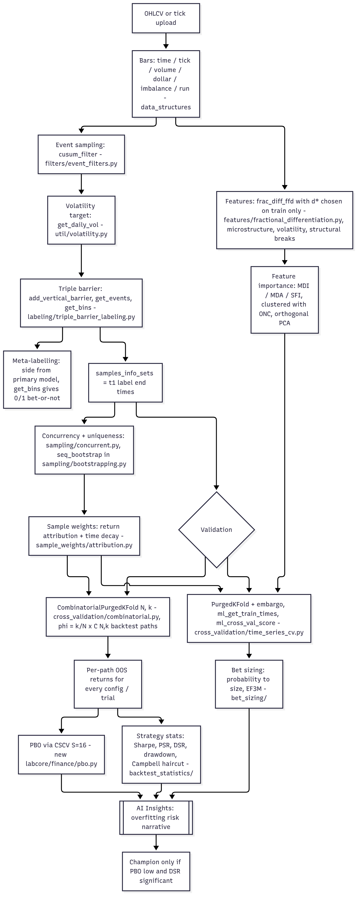

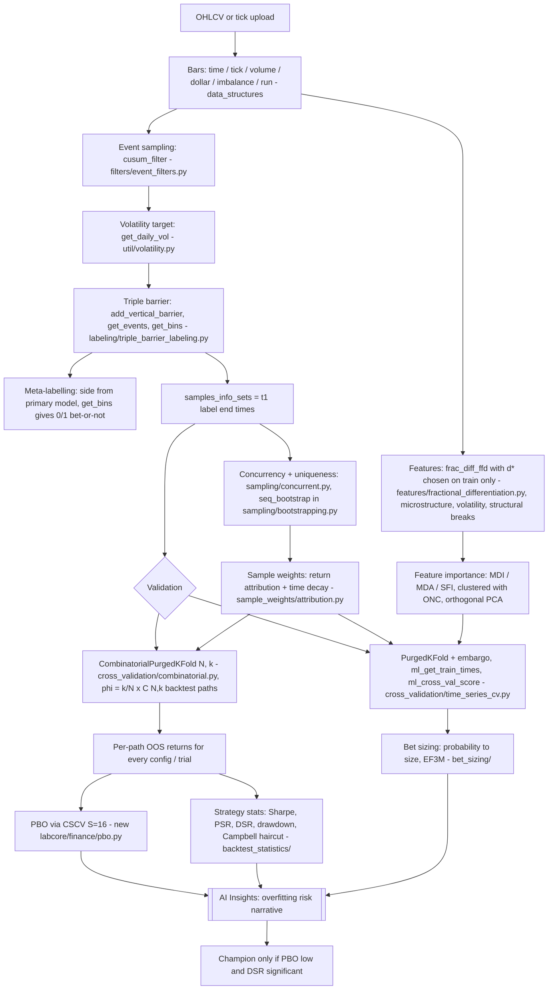
```mermaid
flowchart TD
  A[OHLCV or tick upload] --> B[Bars: time / tick / volume / dollar / imbalance / run - data_structures]
  B --> C[Event sampling: cusum_filter - filters/event_filters.py]
  C --> D[Volatility target: get_daily_vol - util/volatility.py]
  D --> E[Triple barrier: add_vertical_barrier, get_events, get_bins - labeling/triple_barrier_labeling.py]
  E --> E1[Meta-labelling: side from primary model, get_bins gives 0/1 bet-or-not]
  E --> F[samples_info_sets = t1 label end times]
  F --> G[Concurrency + uniqueness: sampling/concurrent.py, seq_bootstrap in sampling/bootstrapping.py]
  G --> H[Sample weights: return attribution + time decay - sample_weights/attribution.py]
  B --> I[Features: frac_diff_ffd with d* chosen on train only - features/fractional_differentiation.py, microstructure, volatility, structural breaks]
  I --> J[Feature importance: MDI / MDA / SFI, clustered with ONC, orthogonal PCA]
  F --> K{Validation}
  K --> K1[PurgedKFold + embargo, ml_get_train_times, ml_cross_val_score - cross_validation/time_series_cv.py]
  K --> K2[CombinatorialPurgedKFold N, k - cross_validation/combinatorial.py, phi = k/N x C N,k backtest paths]
  H --> K1
  H --> K2
  J --> K1
  K2 --> L[Per-path OOS returns for every config / trial]
  L --> M[PBO via CSCV S=16 - new labcore/finance/pbo.py]
  L --> N[Strategy stats: Sharpe, PSR, DSR, drawdown, Campbell haircut - backtest_statistics/]
  K1 --> O[Bet sizing: probability to size, EF3M - bet_sizing/]
  M --> P[[AI Insights: overfitting risk narrative]]
  N --> P
  O --> P
  P --> Q[Champion only if PBO low and DSR significant]
```

## 7. AI Insights sequence

Cache lookup → context builder with FACTS → rule engine → VLM with JSON-schema decoding → validator (numbers + citations) → SSE stream → cached result.

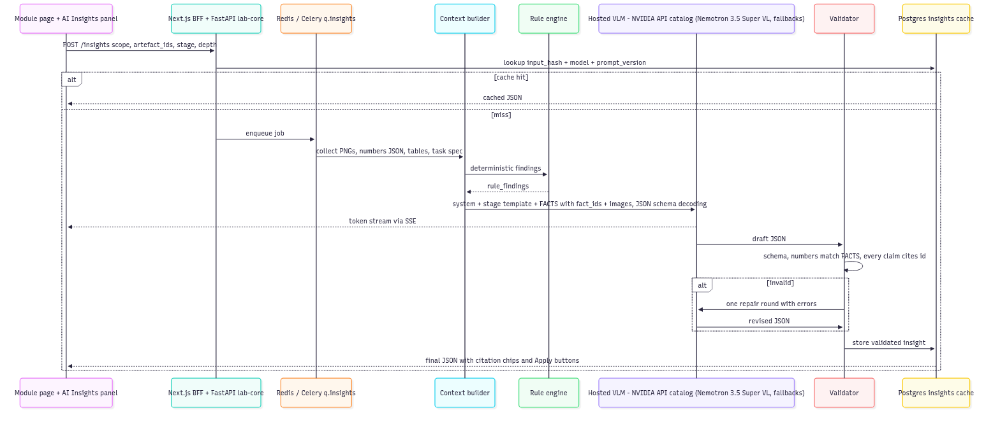

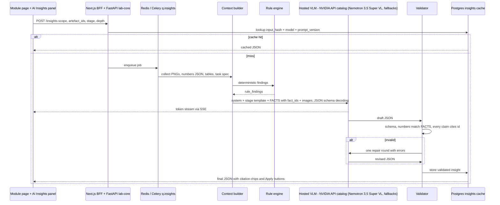
```mermaid
sequenceDiagram
  participant UI as Module page + AI Insights panel
  participant API as Next.js BFF + FastAPI lab-core
  participant R as Redis / Celery q.insights
  participant CB as Context builder
  participant RE as Rule engine
  participant V as Hosted VLM - NVIDIA API catalog (Nemotron 3.5 Super VL, fallbacks)
  participant VAL as Validator
  participant DB as Postgres insights cache
  UI->>API: POST /insights scope, artefact_ids, stage, depth
  API->>DB: lookup input_hash + model + prompt_version
  alt cache hit
    DB-->>UI: cached JSON
  else miss
    API->>R: enqueue job
    R->>CB: collect PNGs, numbers JSON, tables, task spec
    CB->>RE: deterministic findings
    RE-->>CB: rule_findings
    CB->>V: system + stage template + FACTS with fact_ids + images, JSON schema decoding
    V-->>UI: token stream via SSE
    V->>VAL: draft JSON
    VAL->>VAL: schema, numbers match FACTS, every claim cites id
    alt invalid
      VAL->>V: one repair round with errors
      V->>VAL: revised JSON
    end
    VAL->>DB: store validated insight
    DB-->>UI: final JSON with citation chips and Apply buttons
  end
```

## 8. Prediction / inference

Single, batch, what-if and forecast modes with calibrated probabilities, conformal sets, intervals, confidence score and local explanations.

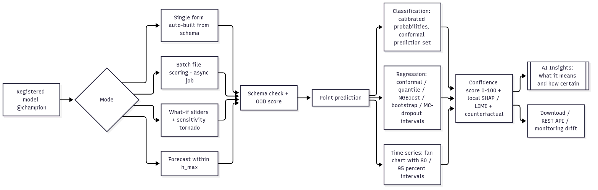

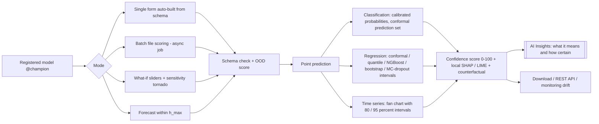
```mermaid
flowchart LR
  A[Registered model @champion] --> B{Mode}
  B --> B1[Single form auto-built from schema]
  B --> B2[Batch file scoring - async job]
  B --> B3[What-if sliders + sensitivity tornado]
  B --> B4[Forecast within h_max]
  B1 --> C[Schema check + OOD score]
  B2 --> C
  B3 --> C
  B4 --> C
  C --> D[Point prediction]
  D --> E1[Classification: calibrated probabilities, conformal prediction set]
  D --> E2[Regression: conformal / quantile / NGBoost / bootstrap / MC-dropout intervals]
  D --> E3[Time series: fan chart with 80 / 95 percent intervals]
  E1 --> F[Confidence score 0-100 + local SHAP / LIME + counterfactual]
  E2 --> F
  E3 --> F
  F --> G[[AI Insights: what it means and how certain]]
  F --> H[Download / REST API / monitoring drift]
```

## 9. Walk-Forward Optimisation (financial / sequential)

Window planner → purge and embargo → per-window recipe fit, re-tuning and retraining by policy → OOS prediction → costs → stitched OOS → DSR, Monte Carlo, PBO and CPCV cross-check → verdict and AI Insights. See ARCHITECTURE §32.

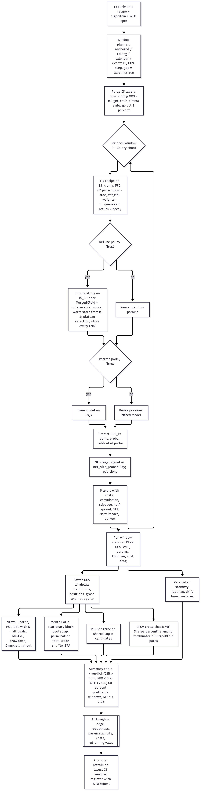

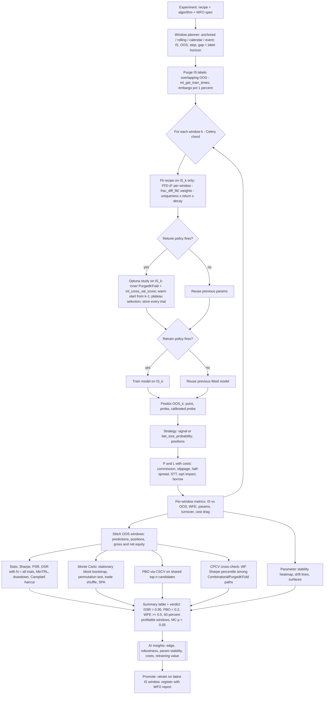
```mermaid
flowchart TD
  A[Experiment: recipe + algorithm + WFO spec] --> B[Window planner: anchored / rolling / calendar / event; IS, OOS, step, gap = label horizon]
  B --> C[Purge IS labels overlapping OOS - ml_get_train_times; embargo pct 1 percent]
  C --> D{For each window k - Celery chord}
  D --> E[Fit recipe on IS_k only; FFD d* per window - frac_diff_ffd; weights - uniqueness x return x decay]
  E --> F{Retune policy fires?}
  F -->|yes| G[Optuna study on IS_k: inner PurgedKFold + ml_cross_val_score; warm start from k-1; plateau selection; store every trial]
  F -->|no| H[Reuse previous params]
  G --> I{Retrain policy fires?}
  H --> I
  I -->|yes| J[Train model on IS_k]
  I -->|no| K[Reuse previous fitted model]
  J --> L[Predict OOS_k: point, proba, calibrated proba]
  K --> L
  L --> M[Strategy: signal or bet_size_probability; positions]
  M --> N[P and L with costs: commission, slippage, half-spread, STT, sqrt impact, borrow]
  N --> O[Per-window metrics: IS vs OOS, WFE, params, turnover, cost drag]
  O --> D
  O --> P[Stitch OOS windows: predictions, positions, gross and net equity]
  P --> Q[Stats: Sharpe, PSR, DSR with N = all trials, MinTRL, drawdown, Campbell haircut]
  P --> R[Monte Carlo: stationary block bootstrap, permutation test, trade shuffle, SPA]
  P --> S[PBO via CSCV on shared top-n candidates]
  P --> T[CPCV cross-check: WF Sharpe percentile among CombinatorialPurgedKFold paths]
  O --> U[Parameter stability heatmap, drift lines, surfaces]
  Q --> V[Summary table + verdict: DSR > 0.95, PBO < 0.2, WFE >= 0.5, 60 percent profitable windows, MC p < 0.05]
  R --> V
  S --> V
  T --> V
  U --> V
  V --> W[[AI Insights: edge, robustness, param stability, costs, retraining value]]
  W --> X[Promote: retrain on latest IS window, register with WFO report]
```

## 10. AI Dataset Intake / Auto-Setup

Profile → detectors (index, frequency, roles, family, targets, leakage) → optional LLM adjudicator with validator → editable Intake Review → confirmed task spec; on updates, schema diff and drift drive carry-forward or re-confirmation. See ARCHITECTURE §33.

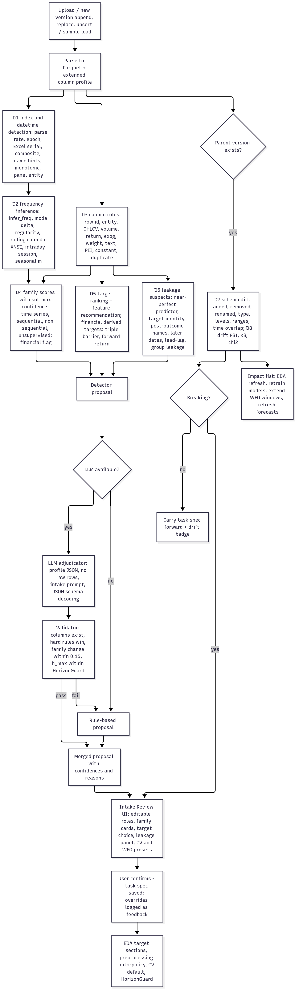

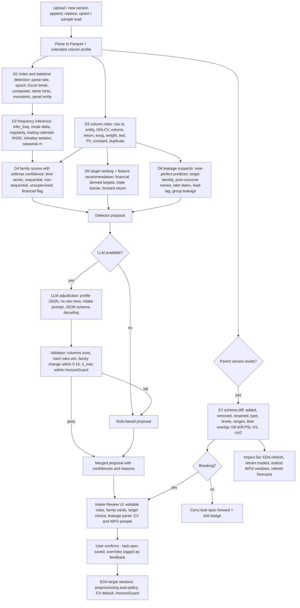
```mermaid
flowchart TD
  A[Upload / new version append, replace, upsert / sample load] --> B[Parse to Parquet + extended column profile]
  B --> C[D1 index and datetime detection: parse rate, epoch, Excel serial, composite, name hints, monotonic, panel entity]
  B --> D[D3 column roles: row id, entity, OHLCV, volume, return, exog, weight, text, PII, constant, duplicate]
  C --> E[D2 frequency inference: infer_freq, mode delta, regularity, trading calendar XNSE, intraday session, seasonal m]
  E --> F[D4 family scores with softmax confidence: time series, sequential, non-sequential, unsupervised; financial flag]
  D --> F
  D --> G[D5 target ranking + feature recommendation; financial derived targets: triple barrier, forward return]
  D --> H[D6 leakage suspects: near-perfect predictor, target identity, post-outcome names, later dates, lead-lag, group leakage]
  F --> I[Detector proposal]
  G --> I
  H --> I
  I --> J{LLM available?}
  J -->|yes| K[LLM adjudicator: profile JSON, no raw rows, intake prompt, JSON schema decoding]
  J -->|no| L[Rule-based proposal]
  K --> M[Validator: columns exist, hard rules win, family change within 0.15, h_max within HorizonGuard]
  M -->|fail| L
  M -->|pass| N[Merged proposal with confidences and reasons]
  L --> N
  N --> O[Intake Review UI: editable roles, family cards, target choice, leakage panel, CV and WFO presets]
  O --> P[User confirms - task spec saved; overrides logged as feedback]
  B --> Q{Parent version exists?}
  Q -->|yes| R[D7 schema diff: added, removed, renamed, type, levels, ranges, time overlap; D8 drift PSI, KS, chi2]
  R --> S{Breaking?}
  S -->|no| T[Carry task spec forward + drift badge]
  S -->|yes| O
  R --> U[Impact list: EDA refresh, retrain models, extend WFO windows, refresh forecasts]
  P --> V[EDA target sections, preprocessing auto-policy, CV default, HorizonGuard]
```

## 11. Deep learning (tabular and sequential)

§34: registries T1–T16 and Q1–Q13, defaults vs customise, CPU/GPU routing, training engine, DL plots/tables, uncertainty, VLM champion step.

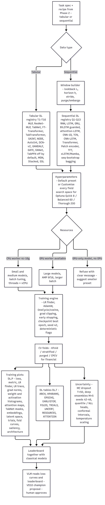

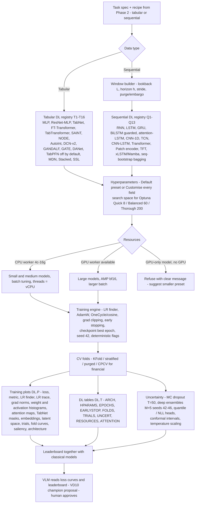
```mermaid
flowchart TD
  A[Task spec + recipe from Phase 2 - tabular or sequential] --> B{Data type}
  B -->|Tabular| T[Tabular DL registry T1-T16<br/>MLP, ResNet-MLP, TabNet, FT-Transformer, TabTransformer, SAINT, NODE,<br/>AutoInt, DCN-v2, GANDALF, GATE, DANet, TabPFN off by default, MDN, Stacked, SSL]
  B -->|Sequential| S[Window builder - lookback L, horizon h, stride, purge/embargo]
  S --> Q[Sequential DL registry Q1-Q13<br/>RNN, LSTM, GRU, BiLSTM guarded, attention-LSTM, CNN-1D, TCN,<br/>CNN-LSTM, Transformer, Patch encoder, TFT, xLSTM/Mamba, seq-bootstrap bagging]
  T --> P[Hyperparameters - Default preset or Customise every field<br/>search space for Optuna Quick 8 / Balanced 60 / Thorough 200]
  Q --> P
  P --> R{Resources}
  R -->|CPU worker 4c-16g| C[Small and medium models, batch tuning, threads = vCPU]
  R -->|GPU worker available| G[Large models, AMP bf16, larger batch]
  R -->|GPU-only model, no GPU| X[Refuse with clear message - suggest smaller preset]
  C --> E[Training engine - LR finder, AdamW, OneCycle/cosine, grad clipping, early stopping,<br/>checkpoint best epoch, seed 42, deterministic flags]
  G --> E
  E --> CV[CV folds - KFold / stratified / purged / CPCV for financial]
  CV --> PL[Training plots DL.P - loss, metric, LR finder, LR trace, grad norms, weight and activation histograms,<br/>attention maps, TabNet masks, embeddings, latent space, trials, fold curves, saliency, architecture]
  CV --> TB[DL tables DL.T - ARCH, HPARAMS, EPOCHS, EARLYSTOP, FOLDS, TRIALS, UNCERT, RESOURCES, ATTENTION]
  CV --> U[Uncertainty - MC dropout T=50, deep ensembles M=5 seeds 42-46, quantile / NLL heads,<br/>conformal intervals, temperature scaling]
  PL --> L[Leaderboard together with classical models]
  TB --> L
  U --> L
  L --> V[VLM reads loss curves and leaderboard - VD10 champion proposal - human approves]
```

## 12. Time series — full pipeline

§35: TS EDA, test tables, stationarity verdict, horizon guard, exogenous checks, F1–F54, multi-step strategies, backtesting, reconciliation, metrics, residual diagnostics, leaderboards.

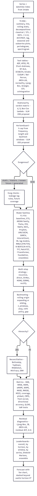

```mermaid
flowchart TD
  A[Series + datetime index from Intake] --> B[TS EDA - summary, line, rolling stats, decompositions classical / STL / MSTL / X-13,<br/>ACF/PACF, lag, seasonal and subseries plots, periodogram, spectrogram]
  B --> C[Test tables - ADF, KPSS, PP, Zivot-Andrews, DF-GLS, OCSB/CH, breaks CUSUM / Bai-Perron,<br/>ARCH-LM, normality, Ljung-Box, Granger, CCF, cointegration]
  C --> D[Stationarity verdict matrix - d, D, Box-Cox lambda - VLM VD6 proposal]
  D --> H[HorizonGuard - h cap from frequency, length and backtest windows - VLM VD5 proposal]
  H --> X{Exogenous?}
  X -->|static / historic / known-future / generated| XE[Exog checks - leakage lag rules, future coverage]
  X -->|none| M
  XE --> M[Model families F1-F54<br/>baselines, ETS, ARIMA family, Theta, CES, TBATS, MSTL, Prophet, VAR/VECM, GARCH,<br/>intermittent, ML lag models, RNN/LSTM/TCN, N-BEATS/N-HiTS, TFT, PatchTST, iTransformer, foundation, ensembles]
  M --> S[Multi-step strategy - recursive, direct, DirRec, MIMO, DIRMO, rectify]
  S --> BT[Backtesting - rolling origin expanding or sliding, n_windows, step, refit policy, gap]
  BT --> HR{Hierarchy?}
  HR -->|yes| REC[Reconciliation - BottomUp, TopDown, MiddleOut, MinTrace, ERM]
  HR -->|no| MET
  REC --> MET[Metrics - MAE, RMSE, MAPE, sMAPE, WAPE, MASE, RMSSE, MSIS, coverage, pinball, CRPS,<br/>Theil U1/U2, directional accuracy, QLIKE, VaR tests]
  MET --> RD[Residual diagnostics - Ljung-Box, JB, ARCH-LM, residual ACF, Q-Q]
  RD --> LB[Leaderboards - overall, by horizon, by window, by series, Diebold-Mariano, ensemble]
  LB --> F[Forecast with fan chart, dashed beyond useful horizon h*]
```

## 13. Dimensionality reduction

§36.5: KMO/Bartlett suitability, linear/factor and manifold methods, component selection with VLM VD7, loadings/communalities, trustworthiness/continuity/Shepard quality.

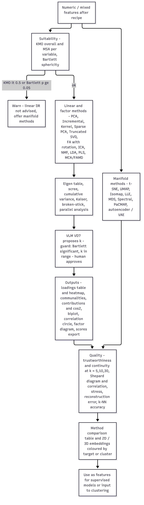

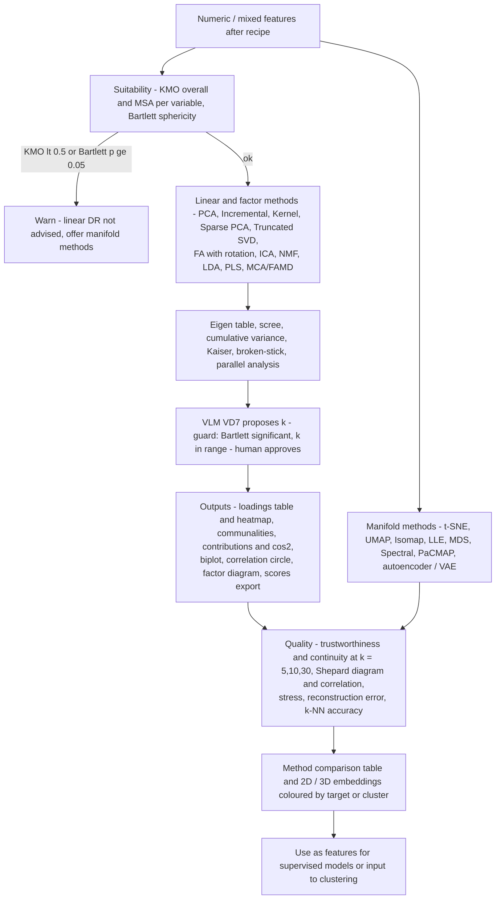
```mermaid
flowchart TD
  A[Numeric / mixed features after recipe] --> K[Suitability - KMO overall and MSA per variable, Bartlett sphericity]
  K -->|KMO lt 0.5 or Bartlett p ge 0.05| W[Warn - linear DR not advised, offer manifold methods]
  K -->|ok| L[Linear and factor methods - PCA, Incremental, Kernel, Sparse PCA, Truncated SVD,<br/>FA with rotation, ICA, NMF, LDA, PLS, MCA/FAMD]
  A --> N[Manifold methods - t-SNE, UMAP, Isomap, LLE, MDS, Spectral, PaCMAP, autoencoder / VAE]
  L --> E[Eigen table, scree, cumulative variance, Kaiser, broken-stick, parallel analysis]
  E --> V[VLM VD7 proposes k - guard: Bartlett significant, k in range - human approves]
  V --> O[Outputs - loadings table and heatmap, communalities, contributions and cos2,<br/>biplot, correlation circle, factor diagram, scores export]
  N --> Q[Quality - trustworthiness and continuity at k = 5,10,30, Shepard diagram and correlation,<br/>stress, reconstruction error, k-NN accuracy]
  O --> Q
  Q --> C[Method comparison table and 2D / 3D embeddings coloured by target or cluster]
  C --> D[Use as features for supervised models or input to clustering]
```

## 14. Clustering

§36.6: k-scan with internal indices, density diagnostics, bootstrap stability, VLM VD8, profiles, geometry plots, external indices, comparison.

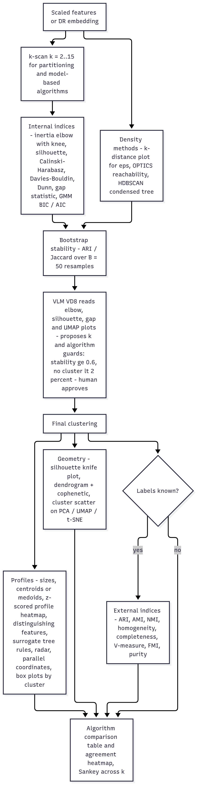

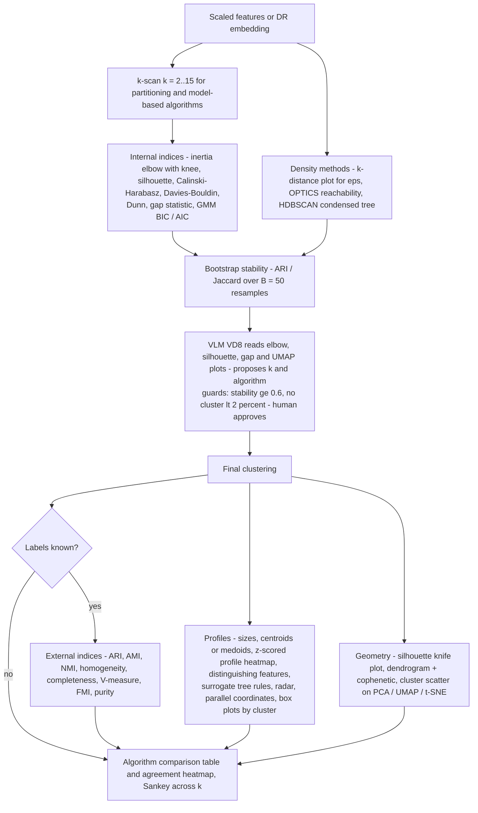
```mermaid
flowchart TD
  A[Scaled features or DR embedding] --> S[k-scan k = 2..15 for partitioning and model-based algorithms]
  S --> I[Internal indices - inertia elbow with knee, silhouette, Calinski-Harabasz, Davies-Bouldin,<br/>Dunn, gap statistic, GMM BIC / AIC]
  A --> DB[Density methods - k-distance plot for eps, OPTICS reachability, HDBSCAN condensed tree]
  I --> ST[Bootstrap stability - ARI / Jaccard over B = 50 resamples]
  DB --> ST
  ST --> V[VLM VD8 reads elbow, silhouette, gap and UMAP plots - proposes k and algorithm<br/>guards: stability ge 0.6, no cluster lt 2 percent - human approves]
  V --> F[Final clustering]
  F --> P[Profiles - sizes, centroids or medoids, z-scored profile heatmap, distinguishing features,<br/>surrogate tree rules, radar, parallel coordinates, box plots by cluster]
  F --> G[Geometry - silhouette knife plot, dendrogram + cophenetic, cluster scatter on PCA / UMAP / t-SNE]
  F --> X{Labels known?}
  X -->|yes| EXT[External indices - ARI, AMI, NMI, homogeneity, completeness, V-measure, FMI, purity]
  X -->|no| R
  EXT --> R[Algorithm comparison table and agreement heatmap, Sankey across k]
  P --> R
  G --> R
```

## 15. Financial labelling suitability check

§37: FS1–FS20 checks, trial labelling, grid preview, per-method verdicts, fallback to standard targets.

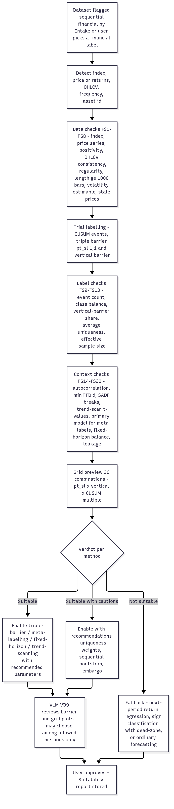

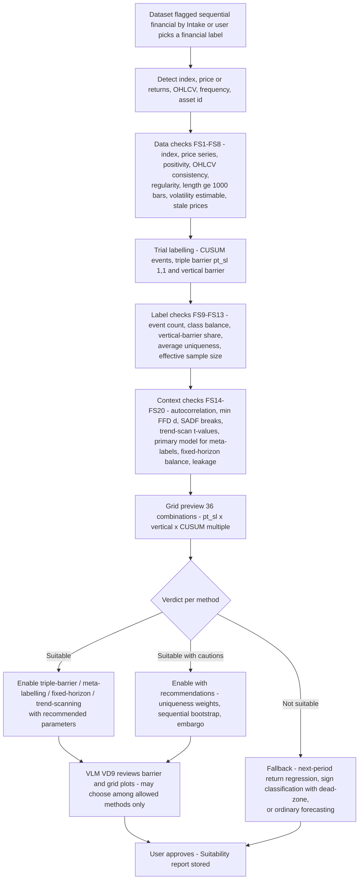
```mermaid
flowchart TD
  A[Dataset flagged sequential financial by Intake or user picks a financial label] --> B[Detect index, price or returns, OHLCV, frequency, asset id]
  B --> C[Data checks FS1-FS8 - index, price series, positivity, OHLCV consistency,<br/>regularity, length ge 1000 bars, volatility estimable, stale prices]
  C --> D[Trial labelling - CUSUM events, triple barrier pt_sl 1,1 and vertical barrier]
  D --> E[Label checks FS9-FS13 - event count, class balance, vertical-barrier share,<br/>average uniqueness, effective sample size]
  E --> F[Context checks FS14-FS20 - autocorrelation, min FFD d, SADF breaks,<br/>trend-scan t-values, primary model for meta-labels, fixed-horizon balance, leakage]
  F --> G[Grid preview 36 combinations - pt_sl x vertical x CUSUM multiple]
  G --> H{Verdict per method}
  H -->|Suitable| OK[Enable triple-barrier / meta-labelling / fixed-horizon / trend-scanning<br/>with recommended parameters]
  H -->|Suitable with cautions| WC[Enable with recommendations - uniqueness weights, sequential bootstrap, embargo]
  H -->|Not suitable| FB[Fallback - next-period return regression, sign classification with dead-zone,<br/>or ordinary forecasting]
  OK --> V[VLM VD9 reviews barrier and grid plots - may choose among allowed methods only]
  WC --> V
  V --> U[User approves - Suitability report stored]
  FB --> U
```

## 16. VLM decision agent loop

§38: observe → baseline → propose → verify → guard → review → apply → log → reflect.

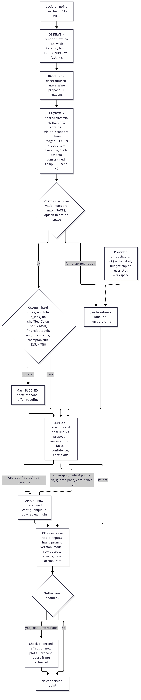

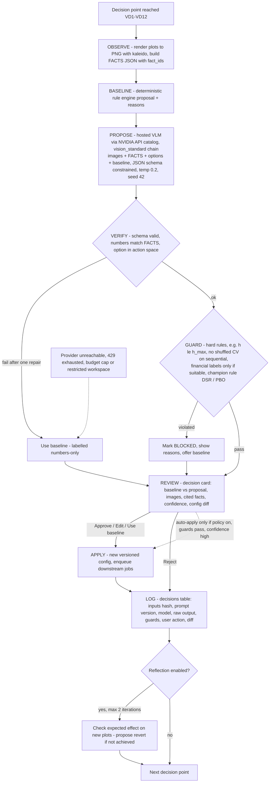
```mermaid
flowchart TD
  A[Decision point reached VD1-VD12] --> O[OBSERVE - render plots to PNG with kaleido, build FACTS JSON with fact_ids]
  O --> B[BASELINE - deterministic rule engine proposal + reasons]
  B --> P[PROPOSE - hosted VLM via NVIDIA API catalog, vision_standard chain<br/>images + FACTS + options + baseline, JSON schema constrained, temp 0.2, seed 42]
  P --> VF{VERIFY - schema valid, numbers match FACTS, option in action space}
  VF -->|fail after one repair| B2[Use baseline - labelled numbers-only]
  VF -->|ok| GD{GUARD - hard rules, e.g. h le h_max, no shuffled CV on sequential,<br/>financial labels only if suitable, champion rule DSR / PBO}
  GD -->|violated| BL[Mark BLOCKED, show reasons, offer baseline]
  GD -->|pass| RV[REVIEW - decision card: baseline vs proposal, images, cited facts, confidence, config diff]
  B2 --> RV
  BL --> RV
  RV -->|Approve / Edit / Use baseline| AP[APPLY - new versioned config, enqueue downstream jobs]
  RV -->|Reject| LG
  RV -.auto-apply only if policy on, guards pass, confidence high.-> AP
  AP --> LG[LOG - decisions table: inputs hash, prompt version, model, raw output, guards, user action, diff]
  LG --> RF{Reflection enabled?}
  RF -->|yes, max 2 iterations| CK[Check expected effect on new plots - propose revert if not achieved]
  RF -->|no| N[Next decision point]
  CK --> N
  NV[Provider unreachable, 429 exhausted, budget cap or restricted workspace] -.-> B2
```

## 17. Deployment and CI/CD

§39: GitHub Actions → Supabase migrations → Render Blueprint (legacy / alternative; the primary backend path is the Contabo VPS in §21) → Vercel → smoke tests; hosted NVIDIA AI API; optional GPU worker (heavy DL) and K8s scale-out.

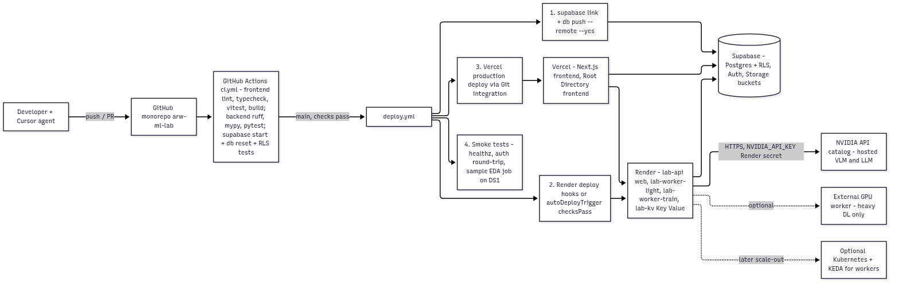

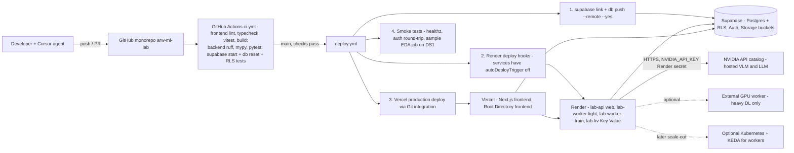
```mermaid
flowchart LR
  DEV[Developer + Cursor agent] -->|push / PR| GH[GitHub monorepo arw-ml-lab]
  GH --> CI[GitHub Actions ci.yml - frontend lint, typecheck, vitest, build;<br/>backend ruff, mypy, pytest; supabase start + db reset + RLS tests]
  CI -->|main, checks pass| DP[deploy.yml]
  DP --> M1[1. supabase link + db push --remote --yes]
  DP --> M2[2. Render deploy hooks - services have autoDeployTrigger off]
  DP --> M3[3. Vercel production deploy via Git integration]
  DP --> M4[4. Smoke tests - healthz, auth round-trip, sample EDA job on DS1]
  M1 --> SB[(Supabase - Postgres + RLS, Auth, Storage buckets)]
  M2 --> RN[Render - lab-api web, lab-worker-light, lab-worker-train, lab-kv Key Value]
  M3 --> VC[Vercel - Next.js frontend, Root Directory frontend]
  RN --> SB
  VC --> SB
  VC --> RN
  RN -->|HTTPS, NVIDIA_API_KEY Render secret| NV[NVIDIA API catalog - hosted VLM and LLM]
  RN -.->|optional| GPU[External GPU worker - heavy DL only]
  RN -.->|later scale-out| K8[Optional Kubernetes + KEDA for workers]
```

## 18. AI provider layer (hosted VLM/LLM)

§40: cache → data classification → budget → image sizing (≤ 170 KB base64) → chain and rate limit → NVIDIA API call → back-off / next model / fallback provider → validation → store; numbers-only whenever AI is unavailable.

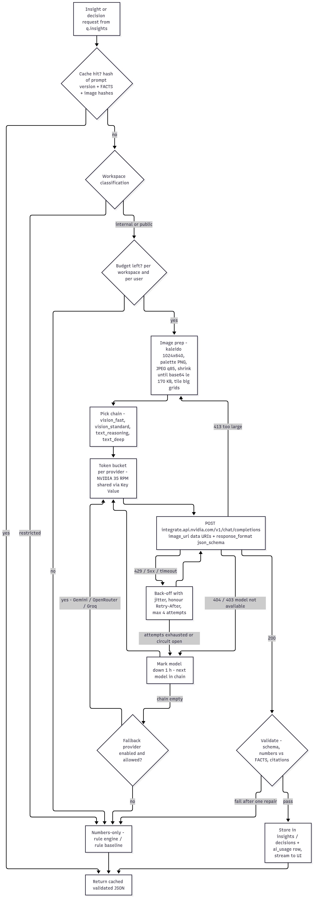

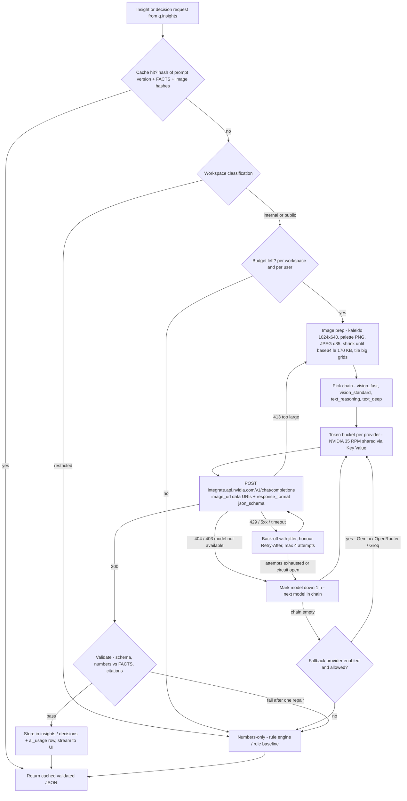
```mermaid
flowchart TD
  R[Insight or decision request from q.insights] --> C{Cache hit? hash of prompt version + FACTS + image hashes}
  C -->|yes| OUT[Return cached validated JSON]
  C -->|no| CL{Workspace classification}
  CL -->|restricted| NO[Numbers-only - rule engine / rule baseline]
  CL -->|internal or public| B{Budget left? per workspace and per user}
  B -->|no| NO
  B -->|yes| IMG[Image prep - kaleido 1024x640, palette PNG, JPEG q85, shrink until base64 le 170 KB, tile big grids]
  IMG --> CH[Pick chain - vision_fast, vision_standard, text_reasoning, text_deep]
  CH --> TB[Token bucket per provider - NVIDIA 35 RPM shared via Key Value]
  TB --> CALL[POST integrate.api.nvidia.com/v1/chat/completions<br/>image_url data URIs + response_format json_schema]
  CALL -->|200| VAL{Validate - schema, numbers vs FACTS, citations}
  CALL -->|429 / 5xx / timeout| BO[Back-off with jitter, honour Retry-After, max 4 attempts]
  BO --> CALL
  CALL -->|404 / 403 model not available| NX[Mark model down 1 h - next model in chain]
  CALL -->|413 too large| IMG
  NX --> TB
  BO -->|attempts exhausted or circuit open| NX
  NX -->|chain empty| FB{Fallback provider enabled and allowed?}
  FB -->|yes - Gemini / OpenRouter / Groq| TB
  FB -->|no| NO
  VAL -->|fail after one repair| NO
  VAL -->|pass| ST[Store in insights / decisions + ai_usage row, stream to UI]
  ST --> OUT
  NO --> OUT
```

## 19. Classification evaluation suite (ARCHITECTURE §41)

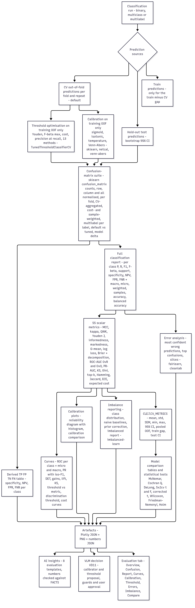

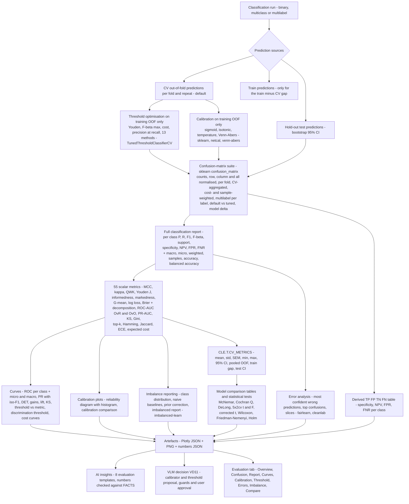
```mermaid
flowchart TD
  RUN[Classification run - binary, multiclass or multilabel] --> SRC{Prediction sources}
  SRC --> OOF[CV out-of-fold predictions per fold and repeat - default]
  SRC --> TEST[Hold-out test predictions - bootstrap 95% CI]
  SRC --> TRN[Train predictions - only for the train minus CV gap]
  OOF --> THR[Threshold optimisation on training OOF only<br/>Youden, F-beta max, cost, precision at recall, 13 methods - TunedThresholdClassifierCV]
  OOF --> CAL[Calibration on training OOF only<br/>sigmoid, isotonic, temperature, Venn-Abers - sklearn, netcal, venn-abers]
  THR --> CM[Confusion-matrix suite - sklearn confusion_matrix<br/>counts, row, column and all normalised, per fold, CV-aggregated,<br/>cost- and sample-weighted, multilabel per label, default vs tuned, model delta]
  CAL --> CM
  TEST --> CM
  CM --> DER[Derived TP FP TN FN table - specificity, NPV, FPR, FNR per class]
  CM --> REP[Full classification report - per class P, R, F1, F-beta, support,<br/>specificity, NPV, FPR, FNR + macro, micro, weighted, samples, accuracy, balanced accuracy]
  REP --> MET[55 scalar metrics - MCC, kappa, QWK, Youden J, informedness, markedness,<br/>G-mean, log loss, Brier + decomposition, ROC-AUC OvR and OvO, PR-AUC, KS, Gini,<br/>top-k, Hamming, Jaccard, ECE, expected cost]
  MET --> CURVES[Curves - ROC per class + micro and macro, PR with iso-F1, DET, gains, lift, KS,<br/>threshold vs metric, discrimination threshold, cost curves]
  MET --> CALP[Calibration plots - reliability diagram with histogram, calibration comparison]
  MET --> IMB[Imbalance reporting - class distribution, naive baselines, prior correction,<br/>imbalanced report - imbalanced-learn]
  MET --> CVT[CLE.T.CV_METRICS - mean, std, SEM, min, max, 95% CI, pooled OOF, train gap, test CI]
  CVT --> CMP[Model comparison tables and statistical tests<br/>McNemar, Cochran Q, DeLong, 5x2cv t and F, corrected t, Wilcoxon, Friedman-Nemenyi, Holm]
  REP --> ERR[Error analysis - most confident wrong predictions, top confusions, slices - fairlearn, cleanlab]
  CURVES --> ART[Artefacts - Plotly JSON + PNG + numbers JSON]
  CALP --> ART
  IMB --> ART
  CMP --> ART
  ERR --> ART
  DER --> ART
  ART --> AI[AI insights - 8 evaluation templates, numbers checked against FACTS]
  ART --> VD[VLM decision VD11 - calibrator and threshold proposal, guards and user approval]
  ART --> UI[Evaluation tab - Overview, Confusion, Report, Curves, Calibration, Threshold, Errors, Imbalance, Compare]
```

## 20. Prediction Studio — batch upload and custom input (ARCHITECTURE §45)

Two modes driven by the feature contract saved at training: (A) batch upload with a validation report (PV01–PV16), chunked scoring and CSV/XLSX downloads; (B) a custom input form generated from the contract with live prediction, SHAP waterfall, what-if sliders and an AI explanation.

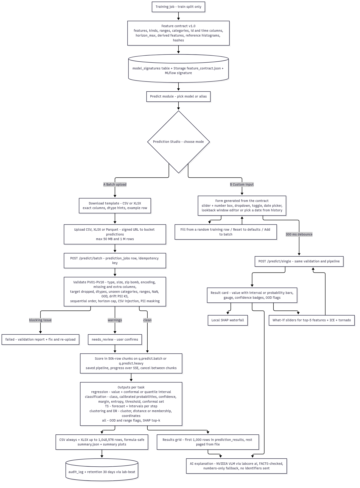

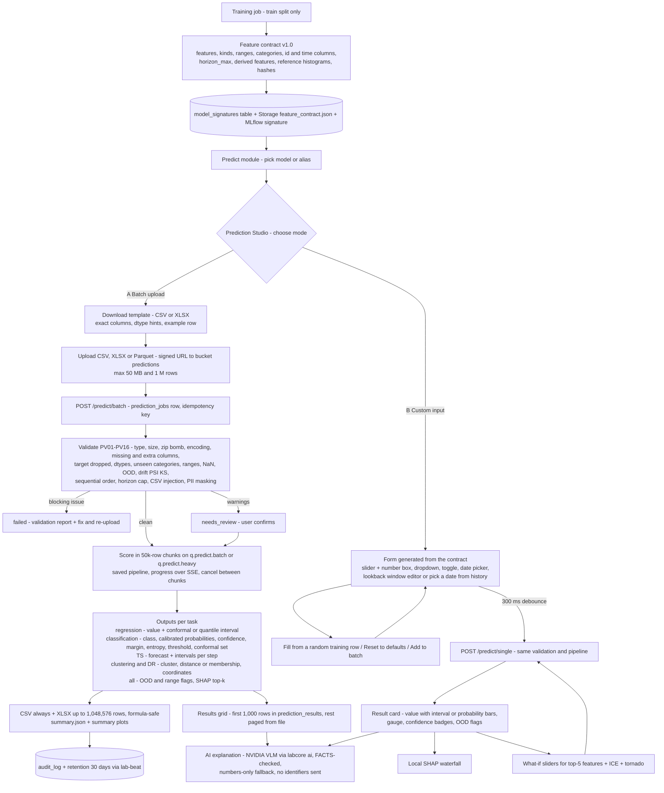
```mermaid
%%{init: {"flowchart": {"wrappingWidth": 420, "nodeSpacing": 30, "rankSpacing": 40}}}%%
flowchart TD
  TRAIN[Training job - train split only] --> FC[Feature contract v1.0<br/>features, kinds, ranges, categories, id and time columns,<br/>horizon_max, derived features, reference histograms, hashes]
  FC --> STORE[(model_signatures table + Storage feature_contract.json + MLflow signature)]
  STORE --> PICK[Predict module - pick model or alias]
  PICK --> MODE{Prediction Studio - choose mode}
  MODE -->|A Batch upload| TPL[Download template - CSV or XLSX<br/>exact columns, dtype hints, example row]
  TPL --> UP[Upload CSV, XLSX or Parquet - signed URL to bucket predictions<br/>max 50 MB and 1 M rows]
  UP --> JOB[POST /predict/batch - prediction_jobs row, idempotency key]
  JOB --> VAL[Validate PV01-PV16 - type, size, zip bomb, encoding, missing and extra columns,<br/>target dropped, dtypes, unseen categories, ranges, NaN, OOD, drift PSI KS,<br/>sequential order, horizon cap, CSV injection, PII masking]
  VAL -->|blocking issue| FAIL[failed - validation report + fix and re-upload]
  VAL -->|warnings| REV[needs_review - user confirms]
  VAL -->|clean| RUN
  REV --> RUN[Score in 50k-row chunks on q.predict.batch or q.predict.heavy<br/>saved pipeline, progress over SSE, cancel between chunks]
  RUN --> OUT[Outputs per task<br/>regression - value + conformal or quantile interval<br/>classification - class, calibrated probabilities, confidence, margin, entropy, threshold, conformal set<br/>TS - forecast + intervals per step<br/>clustering and DR - cluster, distance or membership, coordinates<br/>all - OOD and range flags, SHAP top-k]
  OUT --> FILES[CSV always + XLSX up to 1,048,576 rows, formula-safe<br/>summary.json + summary plots]
  OUT --> GRID[Results grid - first 1,000 rows in prediction_results, rest paged from file]
  MODE -->|B Custom input| FORM[Form generated from the contract<br/>slider + number box, dropdown, toggle, date picker,<br/>lookback window editor or pick a date from history]
  FORM --> BTN[Fill from a random training row / Reset to defaults / Add to batch]
  BTN --> FORM
  FORM -->|300 ms debounce| SINGLE[POST /predict/single - same validation and pipeline]
  SINGLE --> CARD[Result card - value with interval or probability bars,<br/>gauge, confidence badges, OOD flags]
  CARD --> SHAP[Local SHAP waterfall]
  CARD --> WHAT[What-if sliders for top-5 features + ICE + tornado]
  WHAT --> SINGLE
  GRID --> AI[AI explanation - NVIDIA VLM via labcore ai, FACTS-checked,<br/>numbers-only fallback, no identifiers sent]
  CARD --> AI
  FILES --> AUD[(audit_log + retention 30 days via lab-beat)]
```

## 21. Contabo VPS backend deploy (ARCHITECTURE §39.0)

Primary backend path from v2.3: GitHub Actions builds images to GHCR, SSH-deploys Compose on a Contabo VPS behind Caddy HTTPS. Vercel and Supabase unchanged; `render.yaml` remains the legacy alternative.

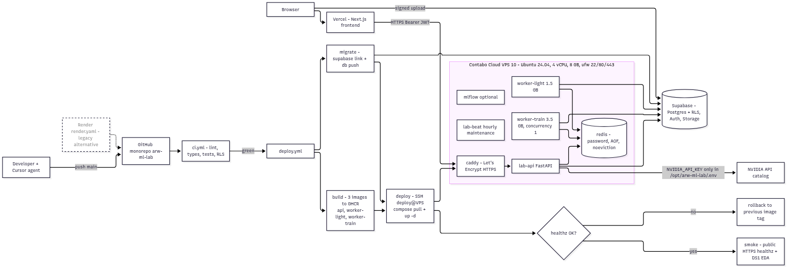

```mermaid
flowchart LR
  DEV[Developer + Cursor agent] -->|push main| GH[GitHub monorepo arw-ml-lab]
  GH --> CI[ci.yml - lint, types, tests, RLS]
  CI -->|green| DP[deploy.yml]
  DP --> MG[migrate - supabase link + db push]
  DP --> BD[build - 3 images to GHCR<br/>api, worker-light, worker-train]
  MG --> DJ
  BD --> DJ[deploy - SSH deploy@VPS<br/>compose pull + up -d]
  DJ --> HC{healthz OK?}
  HC -->|yes| SM[smoke - public HTTPS healthz + DS1 EDA]
  HC -->|no| RB[rollback to previous image tag]
  MG --> SB[(Supabase - Postgres + RLS, Auth, Storage)]
  subgraph VPS[Contabo Cloud VPS 10 - Ubuntu 24.04, 4 vCPU, 8 GB, ufw 22/80/443]
    CD[caddy - Let's Encrypt HTTPS] --> API[lab-api FastAPI]
    API --> RD[(redis - password, AOF, noeviction)]
    WL[worker-light 1.5 GB] --> RD
    WT[worker-train 3.5 GB, concurrency 1] --> RD
    BT[lab-beat hourly maintenance]
    MF[mlflow optional]
  end
  DJ --> CD
  USR[Browser] --> VC[Vercel - Next.js frontend]
  VC -->|HTTPS Bearer JWT| CD
  USR -->|signed upload| SB
  API --> SB
  WL --> SB
  WT --> SB
  API -->|NVIDIA_API_KEY only in /opt/arw-ml-lab/.env| NV[NVIDIA API catalog]
  RN[Render render.yaml - legacy alternative]:::legacy -.-> GH
  classDef legacy stroke-dasharray: 5 5,color:#888

```
